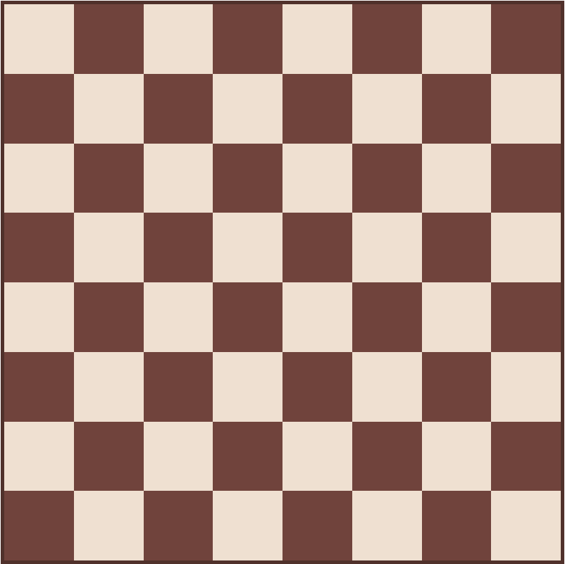
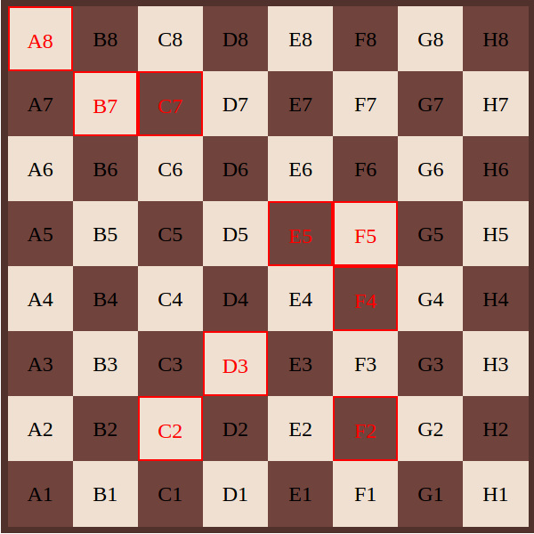

# Challenge S3-J4
Intitulé : **Echiquier**  
https://github.com/O-clock-Explorer/challenge-s3-j2-plus-petit-plus-grand-GuillaumeD84

Guillaume DURAND  
Promo : Explorer  
S3-J4 | 19/10/2017

Formateur : Julien  
Type : JavaScript

## Objectif
Construire un échiquier en JS d'après l'image ci-dessous.

## Bonus
Mettre le nom des cases à l'intérieur de celles-ci et les rendre sélectionnables.

